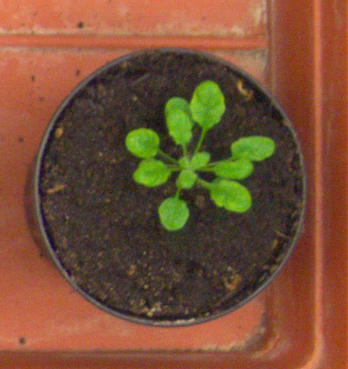
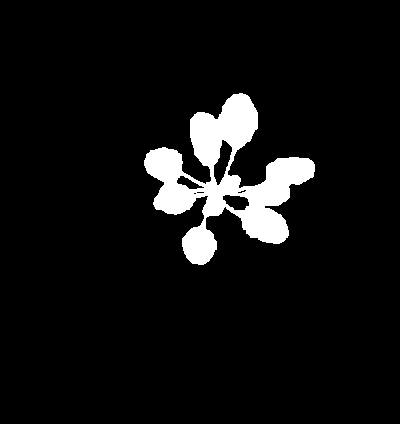
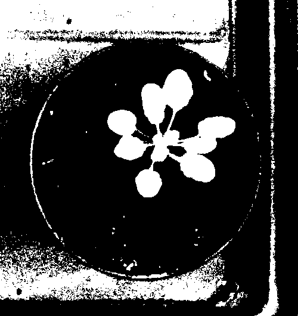
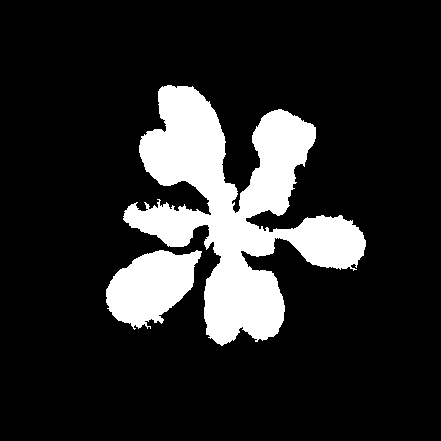
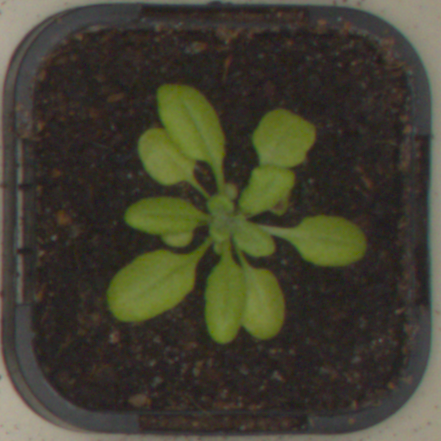
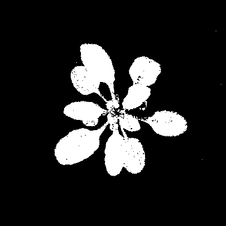
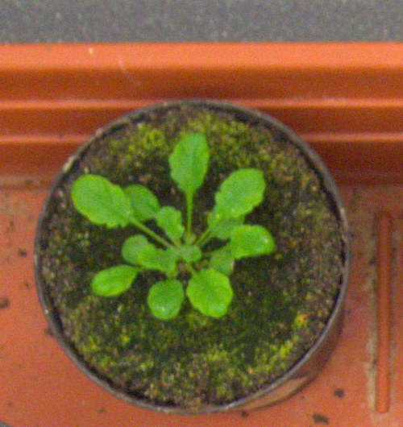
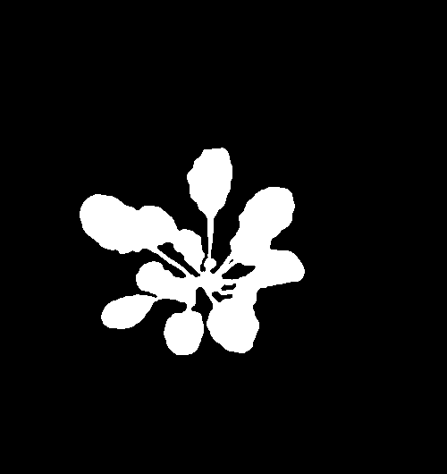
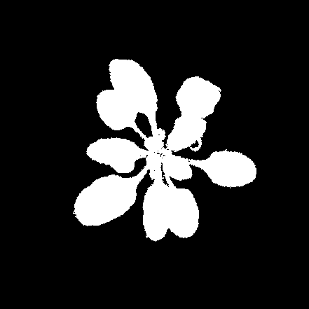

## Plant Segmentation Final Project for CS 639 Computer Vision
### Marianne Bjorner and Carter Sifferman

## Introduction

- TODO: talk abt probs in plant phenotyping

### Motivation

- TODO: Plant phenotyping

## Related Work

- TODO: talk abt existing approaches to cvppp2017:

## Goals

- TODO: talk abt what we hope to get out of it... from this we can set our conclusions and future work

## [CVPPP2017 Dataset](https://www.plant-phenotyping.org/datasets-home)

The CVPPP2017 Dataset is a collection of overhead images of [Arabidopsis](https://elifesciences.org/articles/06100) and Tobacco plants, which are both leafy, green [dicotyledons](https://en.wikipedia.org/wiki/Dicotyledon) and have a [rosette structure](https://en.wikipedia.org/wiki/Rosette_(botany)), meaning they grow in a circular pattern. Because of these features, the CVPPP dataset is not variable, and would be insufficient to test the broader applicability of phenotyping algorithms. 

## [Our Dataset](https://drive.google.com/drive/u/1/folders/1o7BMx_QDEMyHjWjvAFRqM-y4dL1PQiQE)

This vacuum in available plant image data led us to develop our own dataset comprised of more challenging plant photos. Some features of these plants and photos include:

- Leafy Plants, Grasses, Succulents
  - Non-rosette structures
- Non-green plants
- Indoors and Outdoors
- Bright and Dim Light
  - Shadow Effects
- Challenging backgrounds
  - Green Backgrounds
  - Backgrounds with Leaves not belonging to the plant
  - Backgrounds with other variation
  
This dataset is comprised of 68 overhead plant images as well as their annotated binary mask counterparts. Binary masks created with [Photoshop](https://en.wikipedia.org/wiki/Adobe_Photoshop) and [GIMP](https://en.wikipedia.org/wiki/GIMP). Each is 500x500 pixels, and a [tags.json](https://drive.google.com/drive/u/1/folders/1o7BMx_QDEMyHjWjvAFRqM-y4dL1PQiQE) file to differentiate plant and image features, useful for testing an algortihm against a subset of image categories.

## Implementing Existing Algorithms

### [PlantVision](https://github.com/xiyinmsu/PlantVision)

Developed as [Joint Multi-Leaf Segmentation, Alignment, and Tracking for Fluorescence Plant Videos](https://ieeexplore.ieee.org/document/7982753), this tackles the problem of plant leaf segmentation and counting from fluorescent images, with the option of counting them over multiple frames to create a tracked "video" of plant growth.

The original PlantVision algorithm applied multiple filters (e.g. Gaussian followed by a 2-D median filter) before creating an edge image, and then applies [chamfer matching](https://www.sciencedirect.com/topics/engineering/chamfer-matching#:~:text=Chamfer%20matching%20is%20a%20simple,the%20method%20achieves%20subpixel%20accuracy.) using leaf templates which match the input images' rosette leaf structures of arabidopsis and tobacco plants.

#### Difficulties Encountered / Caveats

Because this was developed for fluorescent images of plants, RGB inputs of images needed heavy alteration, and the inbuilt thresholding mechanisms of the algorithm required changes as well. Despite these changes, the algorithm managed to recover few leaves from RGB images, in many cases resulting in blank binary masks.

These changes are reflected in both the [image input](https://github.com/cpsiff/plant-segmentation/blob/main/runFluorescentMethod.m) and [entrance file](https://github.com/cpsiff/plant-segmentation/blob/main/MultiLeafTracking.m) of the original [PlantVision](https://github.com/xiyinmsu/PlantVision) algorithm.

## [Our Segmentation Approaches](https://github.com/cpsiff/plant-segmentation/blob/main/segment.py)

### Green Channel Thresholding

A green channel tresholding algorithm was implemented as a baseline. This approach rests on the assumption that - hey! plants are green! - and therefore images of plants can be separated based on how green these pixels are.

| RGB image | Ground Truth Binary Mask | Green Threshold Result |
| :---: | :---: | :---: |
|  |  |  |

#### Difficulties Encountered / Caveats

Many obvious pitfalls occur when classifying leaves with just RGB values. This approach fails readily. Green backgrounds and bright colors result in false positives.

- TODO: add failure photo 

### K-means Clustering

K-means Clustering creates a set of k clusters of datapoints, or in this case pixels, which minimizes the within-cluster variance of the clusters in an iterative fashion until convergence is reached.  

| RGB image | Ground Truth Binary Mask | Intermediate Result | K-Means Clustering Result |
| :---: | :---: | :---: | :---: |
|  |  |  |  |

#### Difficulties Encountered / Caveats

Due to its reliance on RGB values of pixels, as k increases, it approximates the per-pixel logistic regression method.

### Per-Pixel Logistic Regression

| RGB image | Ground Truth Binary Mask | Per-Pixel Logistic Regression |
| :---: | :---: | :---: |
|  |  |  |

#### Difficulties Encountered / Caveats

Some photos had background noise, where false positives were recovered in the soil surrounding the plant.

| RGB image | Ground Truth Binary Mask | Per-Pixel Logistic Regression |
| :---: | :---: | :---: |
|  |  |  |

### Smoothed and Denoised Per-Pixel Regression

To address the noise in resulting masks of the per-pixel logistic regression, binary masks were post-processed in an attempt to remove background noise.

| RGB image | Ground Truth Binary Mask | Smoothed and Denoised Per-Pixel Logistic Regression |
| :---: | :---: | :---: |
|  |  |  |

#### Difficulties Encountered / Caveats

In some cases, smoothing and denoising resulted in strange artifacts.

-- failure photo --

## Results

We analyzed our results by assigning a [Jaccard Index](https://en.wikipedia.org/wiki/Jaccard_index) to each image. The Jaccard Index, also known as intersection over union, compares the binary mask output of each algorithm and compares them to the ground truth masks. 

Calculations of Jaccard Index and Dice Coefficient driven by [evalutate_segmentation.py](https://github.com/cpsiff/plant-segmentation/blob/main/evaluate_segmentation.py)

### Jaccard Index by Method and Dataset

| Method | CVPPP2017* | Our Dataset|
| --- | --- | --- |
| Green Threshold | [0.31](photos/green_threshold/graph.png) | 0.32 |
| Per-Pixel Regression | [0.75](photos/per_pixel/graph.png) | 0.56 |
| Per-Pixel Regression + Smooth | [0.85](photos/per_pixel_denoise_smooth/graph.png) | 0.66 |
| K-Means Clustering | [0.73](photos/k-means/graph.png) | 0.45 |

* Links lead to result graphs 

## Conclusions / Future Work

TODO: talk about future conclusions as it relates to our goals

## References

[1](https://www.plant-phenotyping.org/) IPPN, the International Plant Phenotyping Network, which hosts the Computer Vision Problems in Plant Phenotyping challenges and datasets.

[2](https://ieeexplore.ieee.org/document/7982753) Yin X, Liu X, Chen J, and Kramer DM. <i>Joint Multi-Leaf Segmentation, Alignment, and Tracking for Fluorescence Plant Videos</i>. 2018. IEEE Transactions on Pattern Analysis and Machine Intelligence.

[3](https://github.com/xiyinmsu/PlantVision) Original PlantVision code posted to Github.

[Github Repository](https://github.com/cpsiff/plant-segmentation)

[Project Proposal](proposal.pdf)

[Midterm Report](midterm.pdf)

[Final Presentation](https://docs.google.com/presentation/d/1-RsaTUuVwnlHyvxS62lsLEATcr5Wvde78qQSAqw-udw/edit?usp=sharing)

[CVPPP2017 LSC Dataset](https://www.plant-phenotyping.org/datasets-home)

[Our Dataset](https://drive.google.com/drive/u/1/folders/1o7BMx_QDEMyHjWjvAFRqM-y4dL1PQiQE)
